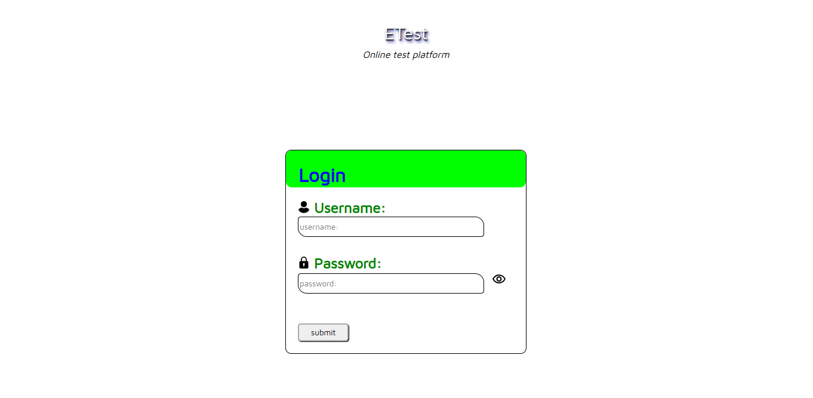
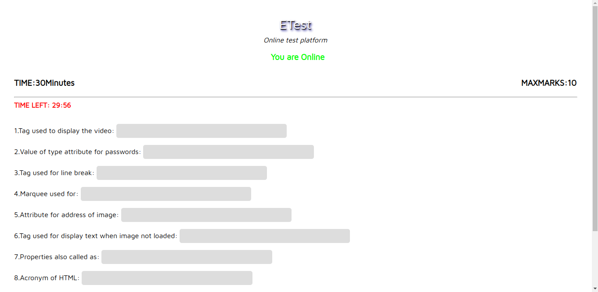
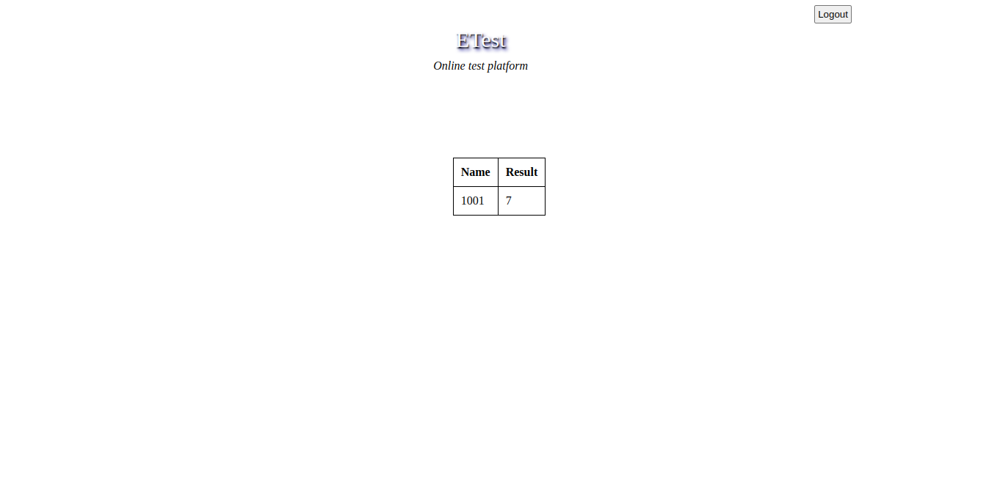

<h1>ExamWeb-Online exam web application</h1>
<h2>Tech Stack Used:</h2>
<h3>Frontend:</h3>
<ul>
	<li>HTML</li>
	<li>css</li>
	<li>Js,DOM</li>
</ul>
<h3>Backend:</h3>
<ul>
	<li>PHP</li>
	<li>MySql for Database</li>
</ul>
<i>An online exam application developed using php with restrictions on window swapping.</i>
<h2>Login Page</h2>

<h2>Exam Paper Page</h2>

<h2>Exam Results Page</h2>

